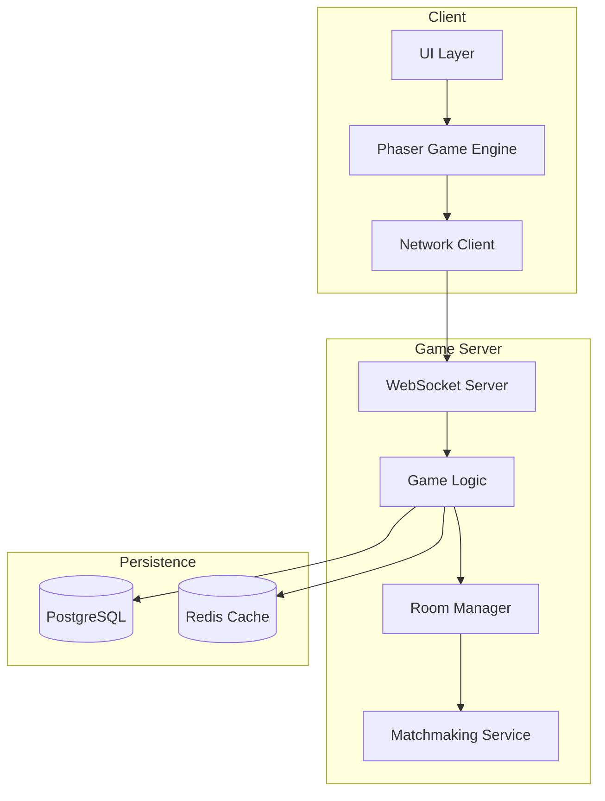
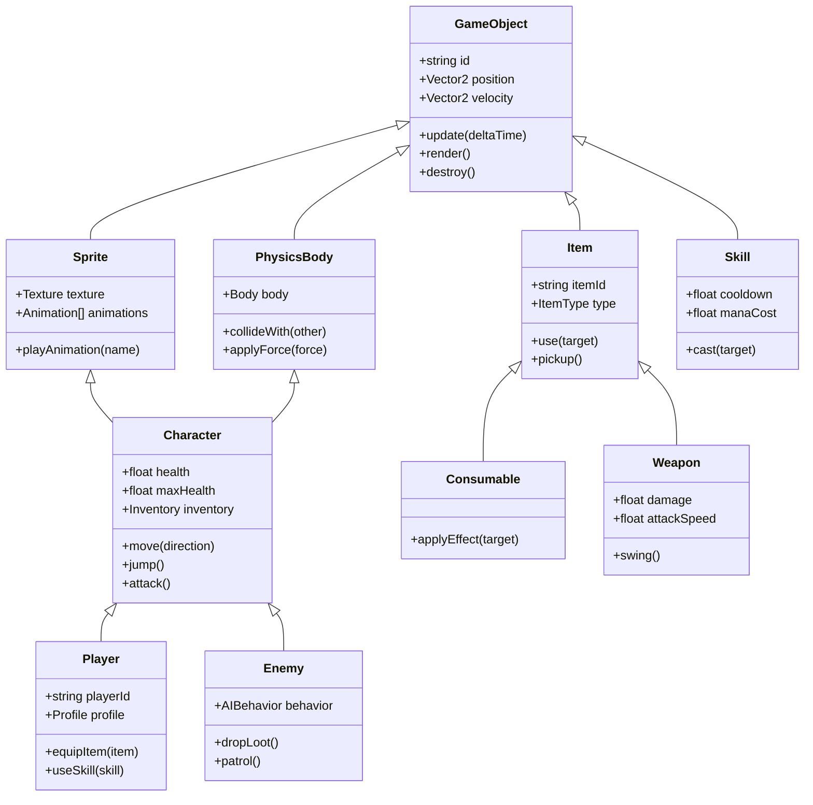
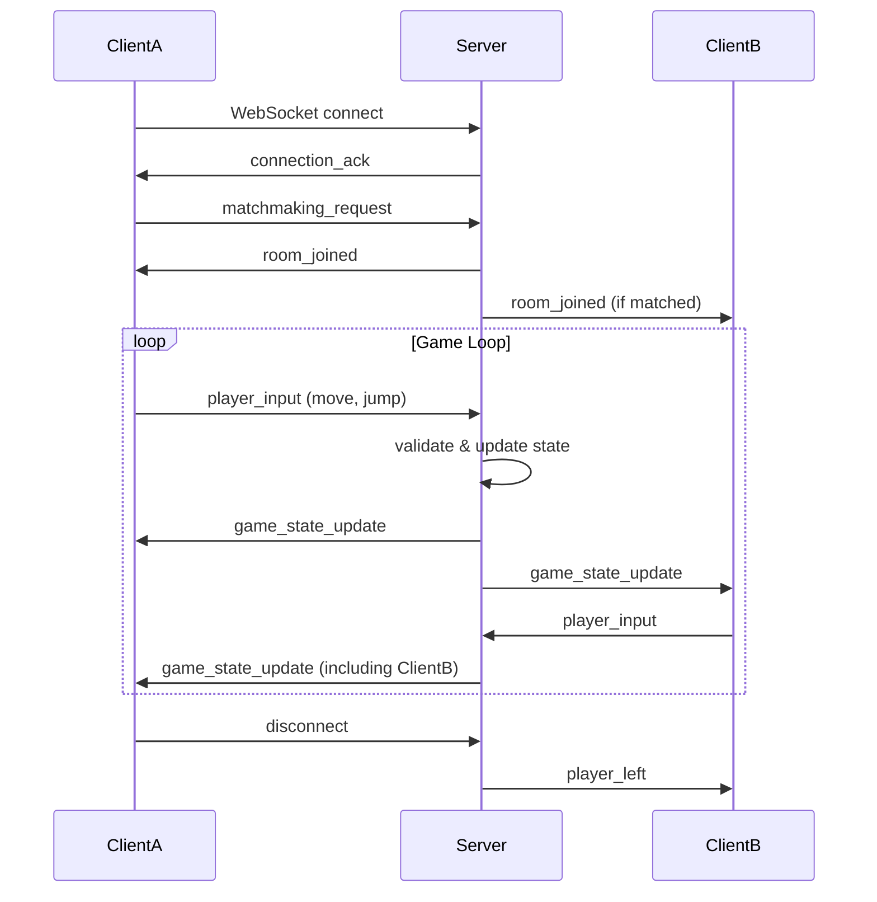

# Phaser-Based Platformer Game Architecture

## High-Level System Architecture

The system consists of three main layers: Client (Game Frontend), Game Server, and Persistence Layer.



## Module Breakdown

### 1. Core Engine (Phaser 3)
- **Game Bootstrapper**: Initializes Phaser game config, sets up renderer, physics, and scene manager.
- **Scene Manager**: Manages game scenes (Boot, Preload, MainMenu, Game, Pause, GameOver).
- **Asset Loader**: Loads images, spritesheets, audio, and other resources.
- **Physics Engine**: Arcade physics for collision detection and movement.

### 2. Game Objects Module
- **Entity Factory**: Creates instances of characters, items, platforms, enemies.
- **Sprite Manager**: Handles sprite animations, transformations, and rendering.
- **Collision System**: Detects and resolves collisions between entities.
- **Camera Controller**: Follows player, manages viewport, and parallax effects.

### 3. Scenes Module
- **Boot Scene**: Initializes core systems and loads configuration.
- **Preload Scene**: Preloads assets with progress bar.
- **MainMenu Scene**: Provides menu UI, settings, and start game.
- **Game Scene**: Main gameplay loop, updates entities, handles input.
- **Pause Scene**: Pause menu and resume functionality.
- **GameOver Scene**: Shows results, stats, and retry options.

### 4. Services Module
- **Network Service**: Manages Socket.IO connections, sends/receives game state updates.
- **Audio Service**: Controls background music and sound effects.
- **Local Storage Service**: Saves local preferences and cached data.
- **Analytics Service**: Tracks gameplay metrics (optional).

### 5. Multiplayer Module
- **Connection Manager**: Establishes and maintains WebSocket connection.
- **State Synchronizer**: Synchronizes game state between clients and server.
- **Lag Compensation**: Predicts movement and reconciles with server authority.
- **Room Management**: Joins/leaves rooms, handles matchmaking.

### 6. Persistence Module
- **Player Profile Service**: Retrieves and updates player profile (level, unlocks, stats).
- **Game Data Service**: Fetches level definitions, item definitions, skill trees.
- **Leaderboard Service**: Updates and retrieves leaderboard rankings.

### 7. Utilities Module
- **Math Utilities**: Vector operations, random number generation, easing functions.
- **Debug Utilities**: Logging, performance profiling, cheat codes.
- **Config Loader**: Loads game configuration from JSON files.

## Class Hierarchy

The game uses an object-oriented design with inheritance and composition. All game entities extend from a base `GameObject` class.



**Explanation:**

- **GameObject**: Abstract base class providing common properties (ID, position, velocity) and lifecycle methods.
- **Sprite**: Handles visual representation, animations, and rendering.
- **PhysicsBody**: Encapsulates physics body (Arcade Physics) for collision and movement.
- **Character**: Combines Sprite and PhysicsBody, adds health, inventory, and basic actions.
- **Player**: Specialized character with player-specific data (profile, equipment) and network synchronization.
- **Enemy**: AI-controlled character with behaviors and loot drops.
- **Item**: Base class for pickable items with usage logic.
- **Consumable**: Item that applies effects (health potion, buff).
- **Weapon**: Item that can be equipped to deal damage.
- **Skill**: Activable ability with cooldown and mana cost.

## Data Flow for Online Multiplayer

### Client-Server Communication
1. **Connection Establishment**:
   - Client connects to server via WebSocket (Socket.IO).
   - Server authenticates using JWT token (if logged in) or assigns a guest session.
   - Server responds with `connection_ack` and initial game state.

2. **Matchmaking Flow**:
   - Client sends `matchmaking_request` with preferences (game mode, region).
   - Matchmaking service finds suitable players and creates a room.
   - Server sends `room_joined` with room ID and player list.
   - All clients in room receive `game_start` with level seed and initial positions.

3. **In-Game Synchronization**:
   - **Client Input**: Player actions (move, jump, attack) are sent as `player_input` events to server.
   - **Server Validation**: Server validates inputs, applies game logic, updates authoritative game state.
   - **State Broadcast**: Server broadcasts `game_state_update` to all clients at fixed tick rate (e.g., 20 Hz).
   - **Client Prediction**: Clients predict local player movement and reconcile with server updates.
   - **Lag Compensation**: Server rewinds time for hit detection based on client latency.

4. **Event-Driven Messages**:
   - **Chat**: `chat_message` broadcast to room.
   - **Item Pickup**: `item_picked_up` triggers inventory update.
   - **Skill Cast**: `skill_cast` triggers animation and effect.
   - **Player Death**: `player_died` triggers respawn timer.

5. **Disconnection Handling**:
   - Client sends `disconnect` or times out.
   - Server marks player as inactive, broadcasts `player_left`.
   - If all players leave, room is cleaned up.

### Data Flow Diagram


### State Synchronization Strategy
- **Snapshot Interpolation**: Server sends full snapshots; clients interpolate between them.
- **Delta Compression**: Only changed entities are sent.
- **Priority System**: Nearby entities have higher update frequency.
- **Interest Management**: Clients receive updates only for entities within their area of interest.

## Persistence Layer Design

### Database Schema (PostgreSQL)
**Players Table**
```sql
CREATE TABLE players (
    id UUID PRIMARY KEY DEFAULT gen_random_uuid(),
    username VARCHAR(50) UNIQUE NOT NULL,
    email VARCHAR(255) UNIQUE,
    password_hash VARCHAR(255),
    created_at TIMESTAMP DEFAULT CURRENT_TIMESTAMP,
    last_login TIMESTAMP,
    experience INTEGER DEFAULT 0,
    level INTEGER DEFAULT 1,
    coins INTEGER DEFAULT 0,
    unlocked_items JSONB DEFAULT '[]',
    stats JSONB DEFAULT '{}'
);
```

**Player Sessions Table**
```sql
CREATE TABLE player_sessions (
    session_id UUID PRIMARY KEY DEFAULT gen_random_uuid(),
    player_id UUID REFERENCES players(id) ON DELETE CASCADE,
    token VARCHAR(512),
    expires_at TIMESTAMP,
    created_at TIMESTAMP DEFAULT CURRENT_TIMESTAMP
);
```

**Leaderboard Table**
```sql
CREATE TABLE leaderboard (
    id UUID PRIMARY KEY DEFAULT gen_random_uuid(),
    player_id UUID REFERENCES players(id) ON DELETE CASCADE,
    score INTEGER NOT NULL,
    game_mode VARCHAR(50) NOT NULL,
    achieved_at TIMESTAMP DEFAULT CURRENT_TIMESTAMP
);
```

**Game Data Tables**
- **levels**: Level definitions (tilemaps, enemy placements, rewards)
- **items**: Item definitions (stats, effects, unlock requirements)
- **skills**: Skill definitions (cooldown, mana cost, damage)
- **achievements**: Achievement definitions and progress

### Caching Strategy (Redis)
- **Player Profiles**: Cache frequently accessed player data (TTL: 5 minutes)
- **Leaderboard Top 100**: Cache sorted sets for quick retrieval
- **Matchmaking Queue**: Store pending matchmaking requests
- **Room State**: Temporary room data (expires when room ends)

### Data Access Layer
- **Repository Pattern**: Each entity has a repository (PlayerRepository, LeaderboardRepository, etc.)
- **Data Mappers**: Convert between database rows and domain objects.
- **Unit of Work**: Manage transactions across multiple operations.

### Progression System
- **Experience & Leveling**: XP gained from completing levels, defeating enemies.
- **Unlockables**: Items, skills, and cosmetics unlocked based on level/achievements.
- **Daily Quests**: Persistent quests reset daily, stored in player's progress.

### Backup & Recovery
- **Regular Backups**: Automated daily backups of PostgreSQL.
- **Point-in-Time Recovery**: WAL archiving enabled.
- **Data Export**: JSON export for player migration.

## Performance Considerations

### Asset Loading & Management
- **Texture Atlases**: Combine multiple sprites into a single texture to reduce draw calls.
- **Lazy Loading**: Load assets on-demand per scene, unload unused assets.
- **Preloading**: Critical assets (player sprites, UI) preloaded in Boot scene.
- **Compression**: Use WebP for images, OGG for audio (with fallback).
- **CDN**: Serve static assets via CDN with caching headers.

### Rendering Optimizations
- **Sprite Batching**: Use Phaser's `StaticGroup` for static objects.
- **Culling**: Only render entities within camera viewport.
- **Particle Limits**: Cap particle effects to prevent frame drops.
- **Canvas vs WebGL**: Choose WebGL for better performance, with fallback to Canvas.
- **Frame Rate Cap**: Limit to 60 FPS to reduce CPU/GPU usage.

### Network Performance
- **Message Compression**: Use Protocol Buffers or MessagePack for binary serialization.
- **Bandwidth Throttling**: Limit update frequency based on connection quality.
- **Client-Side Prediction**: Reduce perceived latency by predicting movement.
- **Interpolation**: Smooth movement between snapshots.
- **Lag Compensation**: Server-side rewind for hit detection.

### Server-Side Optimizations
- **Scalability**: Use Node.js cluster mode with Socket.IO adapter for multi-core.
- **Load Balancing**: Distribute rooms across multiple server instances.
- **Database Connection Pooling**: Use PgBouncer for PostgreSQL connection pooling.
- **Redis for Session Storage**: Store session data in Redis for fast access.
- **Rate Limiting**: Prevent abuse by limiting client messages per second.

### Memory Management
- **Object Pooling**: Reuse game objects (bullets, particles) instead of creating/destroying.
- **Garbage Collection**: Minimize allocations in game loop to avoid GC pauses.
- **Leak Detection**: Monitor memory usage in production.

### Latency Mitigation
- **Region-Based Matchmaking**: Match players in same geographic region.
- **Ping-Based Routing**: Use lowest-latency server.
- **Client-Side Smoothing**: Interpolate positions over time.

### Monitoring & Profiling
- **Real‑Time Metrics**: Monitor FPS, latency, packet loss, memory usage.
- **Alerting**: Set up alerts for performance degradation.
- **A/B Testing**: Test performance impact of new features.

## Directory Structure Proposal

```
phaser-platformer/
├── client/                          # Phaser 3 TypeScript frontend
│   ├── public/                      # Static assets (HTML, CSS, images, sounds)
│   │   ├── assets/
│   │   │   ├── sprites/
│   │   │   ├── tilesets/
│   │   │   ├── audio/
│   │   │   └── fonts/
│   │   ├── index.html
│   │   └── favicon.ico
│   ├── src/
│   │   ├── core/                    # Core engine
│   │   │   ├── Game.ts
│   │   │   ├── SceneManager.ts
│   │   │   └── AssetLoader.ts
│   │   ├── scenes/                  # Game scenes
│   │   │   ├── BootScene.ts
│   │   │   ├── PreloadScene.ts
│   │   │   ├── MainMenuScene.ts
│   │   │   ├── GameScene.ts
│   │   │   ├── PauseScene.ts
│   │   │   └── GameOverScene.ts
│   │   ├── entities/                # Game objects
│   │   │   ├── GameObject.ts
│   │   │   ├── Character.ts
│   │   │   ├── Player.ts
│   │   │   ├── Enemy.ts
│   │   │   ├── Item.ts
│   │   │   └── Skill.ts
│   │   ├── components/              # Reusable components
│   │   │   ├── PhysicsBody.ts
│   │   │   ├── SpriteComponent.ts
│   │   │   └── Inventory.ts
│   │   ├── services/                # Services
│   │   │   ├── NetworkService.ts
│   │   │   ├── AudioService.ts
│   │   │   └── LocalStorageService.ts
│   │   ├── utils/                   # Utilities
│   │   │   ├── math.ts
│   │   │   ├── logger.ts
│   │   │   └── config.ts
│   │   ├── config/                  # Configuration files
│   │   │   ├── gameConfig.ts
│   │   │   └── physicsConfig.ts
│   │   └── main.ts                  # Entry point
│   ├── package.json
│   ├── tsconfig.json
│   ├── webpack.config.js
│   └── .env.local
├── server/                          # Node.js backend
│   ├── src/
│   │   ├── api/                     # REST API endpoints
│   │   │   ├── auth/
│   │   │   ├── players/
│   │   │   └── leaderboard/
│   │   ├── game/                    # Game server logic
│   │   │   ├── GameServer.ts
│   │   │   ├── RoomManager.ts
│   │   │   ├── MatchmakingService.ts
│   │   │   └── GameLogic.ts
│   │   ├── network/                 # Socket.IO handlers
│   │   │   ├── SocketManager.ts
│   │   │   ├── events/
│   │   │   └── middleware/
│   │   ├── persistence/             # Data access layer
│   │   │   ├── repositories/
│   │   │   ├── models/
│   │   │   └── database.ts
│   │   ├── services/                # Business logic
│   │   │   ├── PlayerService.ts
│   │   │   ├── LeaderboardService.ts
│   │   │   └── AnalyticsService.ts
│   │   ├── utils/                   # Server utilities
│   │   │   ├── logger.ts
│   │   │   ├── validation.ts
│   │   │   └── crypto.ts
│   │   └── index.ts                 # Server entry point
│   ├── package.json
│   ├── tsconfig.json
│   └── .env
├── shared/                          # Shared code between client & server
│   ├── types/                       # TypeScript interfaces
│   ├── constants/                   # Game constants
│   └── utils/                       # Shared utilities
├── infrastructure/                  # Infrastructure as code
│   ├── docker/
│   │   ├── Dockerfile.client
│   │   ├── Dockerfile.server
│   │   └── docker-compose.yml
│   ├── kubernetes/                  # K8s manifests
│   └── terraform/                   # Cloud provisioning
├── docs/                            # Documentation
│   ├── architecture.md
│   ├── api.md
│   └── deployment.md
├── tests/                           # Test suites
│   ├── client/
│   ├── server/
│   └── integration/
├── scripts/                         # Build/deployment scripts
├── .gitignore
├── README.md
└── package.json                     # Root package.json (workspace)
```

**Key Points:**
- **Monorepo** structure using npm/yarn workspaces for client, server, shared.
- **TypeScript** across both client and server for type safety.
- **Separation of concerns** with clear module boundaries.
- **Scalable** directory layout that can grow with the project.
- **Infrastructure** ready for containerization and cloud deployment.